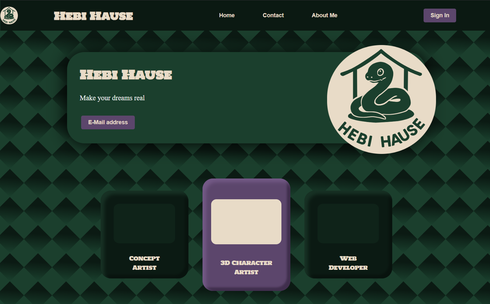

# Hebi Hause – Personal Portfolio Website

My very first fully self-developed and self-designed website (2025).  
A clean, responsive single-page portfolio that combines my passion for UI/UX design and front-end development.

Live demo → https://HebiHause.github.io/hebi-hause-portfolio

## Preview


## Features
- 100 % vanilla HTML5 + CSS3 (no frameworks)
- Modern CSS layout techniques: Flexbox, Grid, CSS custom properties
- Dark snake-themed branding with original logo and colour palette
- Semantic markup and accessible structure
- Fast loading – no external dependencies

## Technologies used
- HTML5
- CSS3 (Flexbox, Grid, :has(), container queries)
- Figma → design & prototyping (UI/UX created by myself)
- Git & GitHub for version control

## Thoughts
So far, this is just the beginning for me. I have plans and goals, and I understand how important it is to document my first steps.
In my next projects, I will embed a 3D model into the website.

## Setup & run locally
```bash
git clone https://github.com/HebiHause/hebi-hause-portfolio.git
cd hebi-hause-portfolio

